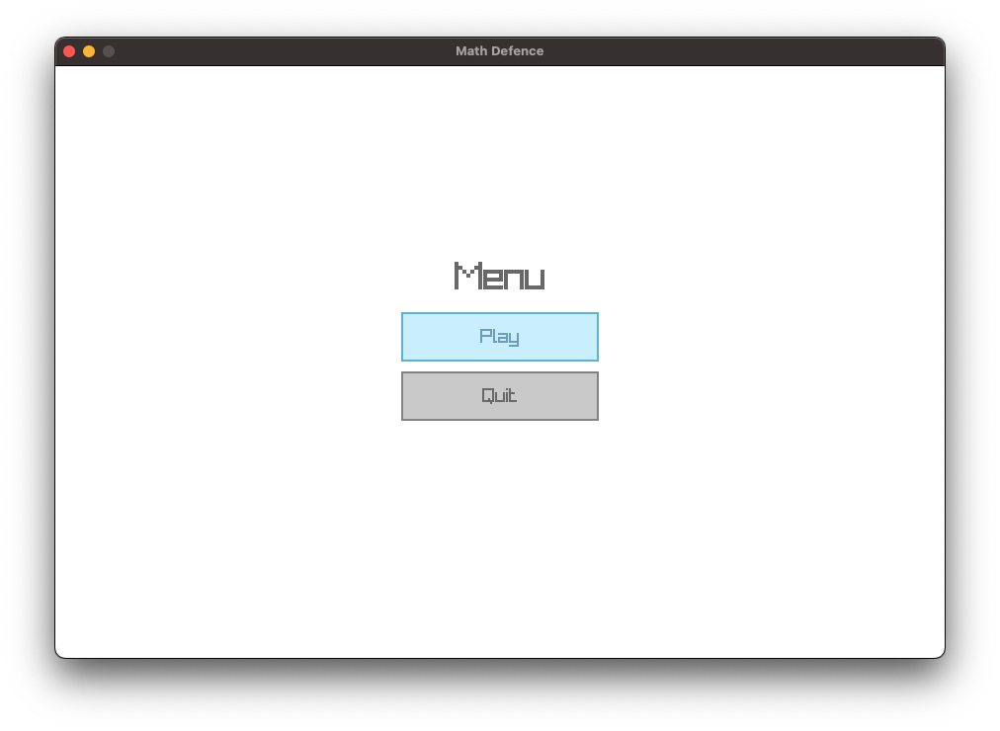
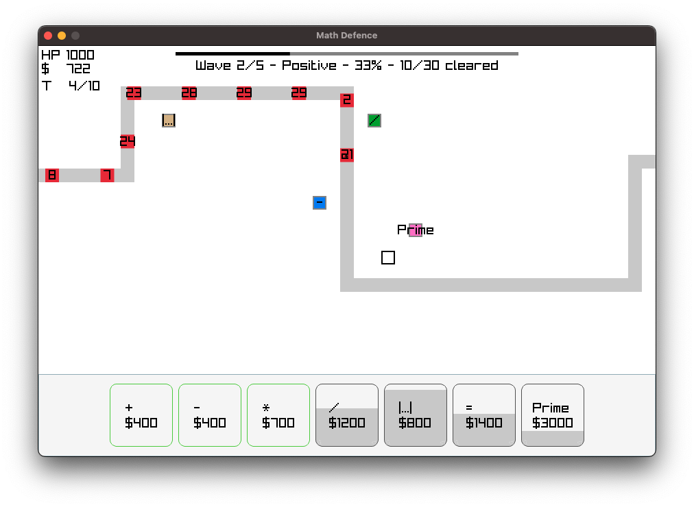
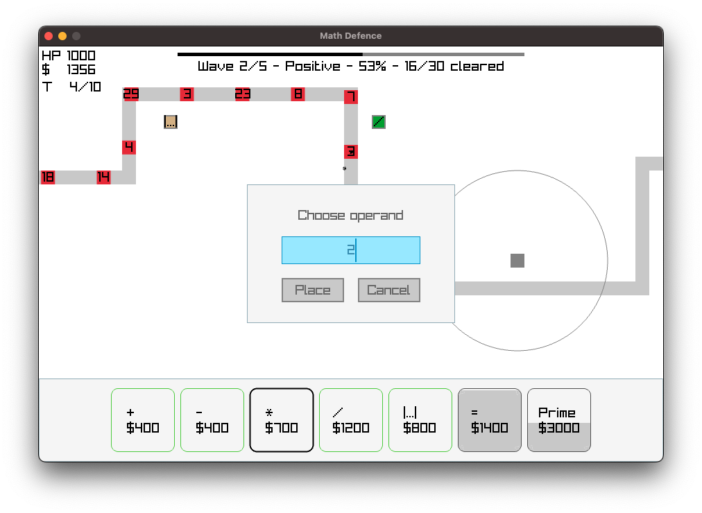
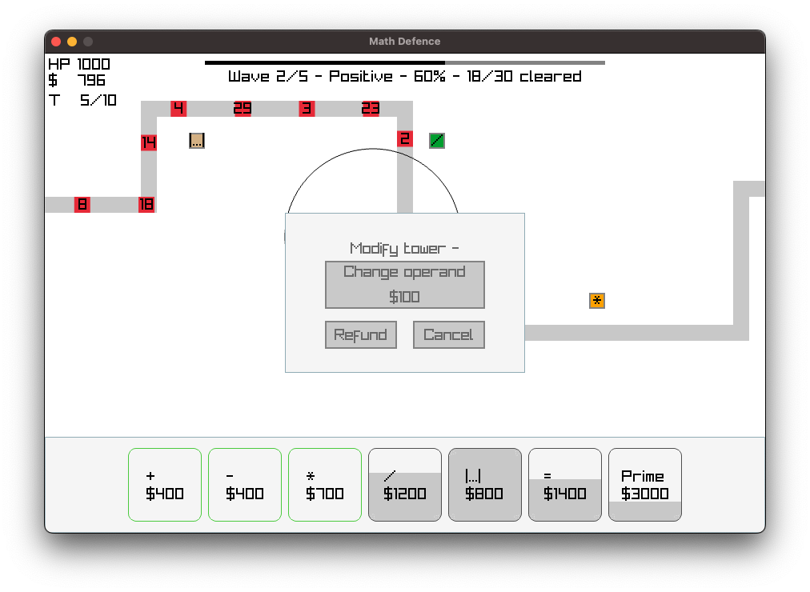

# Math Defence

## Overview

My small summer game project written in C using raylib and RayGUI.

A tower-defence game with a mathematical theme. Enemies are positive and negative integers and towers perform mathematical operations on them based on its type. An enemy is killed when its value becomes zero.

<table>
  <tr>
    <td></td>
    <td></td>
  </tr>
  <tr>
    <td></td>
    <td></td>
  </tr>
</table>


## Gameplay

Gameplay currently consists of one level with the total of 5 waves, each wave can have a different theme that is selected randomly and can include numbers that are:

1. Random
2. Positive
3. Negative
4. Even
5. Odd
6. Prime
7. Square

Difficulty increase progressively with each wave as the total number of enemies and the range of their magnitudes increases. 

The player can purchase towers from the inventory and place them anywhere in the world except on the enemy path or on another tower. Some towers require the player to choose an operand before they can be placed.

The goal is to reduce enemy values to zero before they reach the end of the path.

## Towers

Towers that are available for the player to purchase:

| Tower                    | Description                                        |
| ------------------------ | -------------------------------------------------- |
| Addition (`+`)           | Adds a chosen value to the enemy.                  |
| Subtraction (`-`)        | Subtracts a chosen value from the enemy.           |
| Multiplication (`*`)     | Multiplies the enemy value by a chosen value.      |
| Division (`/`)           | Divides evenly divisible enemy values.             |
| Equals (`=`)             | Defeats enemies matching a chosen value.           |
| Prime                    | Defeats enemies whose values are prime.            |
| Absolute Value (`\|x\|`) | Converts negative enemy values to positive values. |

## Currency

Currency is used to purchase towers and change their operands.

Currency is earned by reducing enemy values and defeating enemies. Towers can also be refunded for part of their original cost.

## Health

Enemies that reach the end of the path damage the player based on the magnitude of their remaining value.

The game is lost when the player's health reaches zero. The game is won by completing all waves without losing all health.

## Controls

| Control            | Action                                         |
| ------------------ | ---------------------------------------------- |
| Left mouse button  | Drag and place towers from the inventory.      |
| Right mouse button | Open the modification menu for a placed tower. |
| `R`                | Show or hide tower attack ranges.              |
| `Escape`           | Return to the main menu.                       |

## Build and run

Game requires raylib that needs to be installed on your system.
Build and run with `make`:

```bash
make run
```
